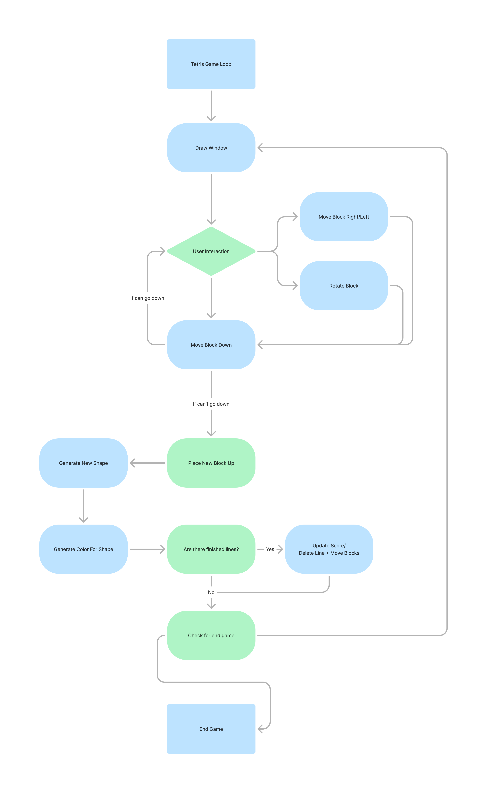

# **Tetris Game Functional Specification**

---

### **1. Document Control**

| Version  | Date       | Author        | Comments                      |
|----------|------------|---------------|--------------------------------|
| 1.0      | 16.10.2024 | Filip Kohout     | Initial Draft                  |

---

### **2. Table of Contents**

- [**Tetris Game Functional Specification**](#tetris-game-functional-specification)
    - [**1. Document Control**](#1-document-control)
    - [**2. Table of Contents**](#2-table-of-contents)
    - [**3. Introduction**](#3-introduction)
    - [**4. Scope**](#4-scope)
    - [**5. Definitions and Acronyms**](#5-definitions-and-acronyms)
    - [**6. System Overview**](#6-system-overview)
    - [**7. Functional Requirements**](#7-functional-requirements)
      - [**7.1. Game Loop**](#71-game-loop)
      - [**7.2. Tetromino Movement and Rotation**](#72-tetromino-movement-and-rotation)
      - [**7.3. Collision Detection**](#73-collision-detection)
      - [**7.4. Line Completion**](#74-line-completion)
      - [**7.5. Score Calculation**](#75-score-calculation)
      - [**7.6. Game Over Condition**](#76-game-over-condition)
      - [**7.7. Background Music**](#77-background-music)
      - [**7.8. Tetromino Colors**](#78-tetromino-colors)
      - [**7.9. Speeding Based on Score**](#79-speeding-based-on-score)
      - [**7.10. Terminal Block Size**](#710-terminal-block-size)
      - [**7.11. Next Tetromino Preview**](#711-next-tetromino-preview)
    - [**8. Non-Functional Requirements**](#8-non-functional-requirements)
    - [**9. Assumptions and Dependencies**](#9-assumptions-and-dependencies)

---

### **3. Introduction**  

The purpose of this document is to describe the functional requirements for the Tetris game. This document serves as a guideline for developers to implement core features and functionality based on the SRS and provided workflow diagram. The game is developed using C# and runs in a terminal environment.

---

### **4. Scope**  

The Tetris game is designed to simulate the classic Tetris gameplay. It involves moving tetromino shapes to fill horizontal lines. The game ends when there is no space to place a new shape. The scope covers basic gameplay, user input handling, scoring, music, block size, and the logic for handling game-ending conditions.

---

### **5. Definitions and Acronyms**  

- **Tetromino**: A geometric shape composed of four squares connected orthogonally.
- **Game Loop**: The core loop responsible for updating and rendering the game state.
- **Grid**: A 2D array representing the game board.
- **SRS**: Software Requirements Specification.

---

### **6. System Overview**  

The Tetris game will be a single-player application where the user interacts with falling blocks (tetrominoes) to form horizontal lines. The user will be able to move tetrominoes left, right, down, and rotate them. The score will increase as the player completes lines, and the speed of the game will increase based on the score. The game will end when there is no room to place new tetrominoes. The game will also feature background music and tetrominoes will be displayed in different colors.

User will start the game by executing binary, then control block by using arrow keys or wasd keys, x,z and spacebar

- Left and Right key (equivalent a,d or z,x) - rotating block
- Space bar (equivalent down arrow or s key) - make block fall faster
- W and Up arrow key can be used for rotating block or have pausing capability

---

### **7. Functional Requirements**

#### **7.1. Game Loop**

**Description**:  
The game loop is responsible for continuously updating the game state and rendering the current state to the screen. It manages the flow of the game, including the movement of tetrominoes, collision detection, and checking for game-over conditions.

**Functional Requirement ID**: FR-001  
**Inputs**: None  
**Outputs**: Updated game state (rendered grid, falling tetromino, score)  
**Behavior**:

- The game loop will run until the game-over condition is met.
- The game loop calls `drawWindow()` to render the current state.
- It handles user inputs via the `handleUserInput()` function.
- Calls `moveBlockDown()` every game tick to advance the falling tetromino.
  
---

#### **7.2. Tetromino Movement and Rotation**

**Description**:  
Users can move tetrominoes left, right, down, or rotate them using keyboard inputs. Movement is constrained by the boundaries of the grid and other placed blocks.

**Functional Requirement ID**: FR-002  
**Inputs**: Arrow keys for movement, rotation keys for rotating tetrominoes  
**Outputs**: Updated tetromino position on the grid  
**Behavior**:

- The `handleUserInput()` function will detect key presses.
- Left and right arrow keys will trigger `moveBlockLeftRight()` to shift the tetromino.
- The down arrow will trigger faster descent using `moveBlockDown()`.
- The rotate button will rotate the tetromino via the `rotateBlock()` function.
  
---

#### **7.3. Collision Detection**

**Description**:  
The system checks for collisions between falling tetrominoes and other blocks or the boundaries of the grid.

**Functional Requirement ID**: FR-003  
**Inputs**: Current tetromino position, grid state  
**Outputs**: Boolean (collision detected or not)  
**Behavior**:

- `checkCollision()` will validate whether the tetromino can move to a new position without overlapping a filled block or exceeding grid boundaries.
- If a collision is detected, the tetromino will either stop moving (when falling) or be prevented from moving (left/right/rotation).

---

#### **7.4. Line Completion**

**Description**:  
When a horizontal line is fully filled with blocks, the system will clear the line and shift blocks above it downward.

**Functional Requirement ID**: FR-004  
**Inputs**: Grid state after tetromino placement  
**Outputs**: Updated grid, score  
**Behavior**:

- `checkCompletedLines()` will scan each row of the grid after a tetromino is placed.
- Completed lines will be cleared, and blocks above will move down.
- The score will be updated based on the number of lines cleared (see 7.5).

---

#### **7.5. Score Calculation**

**Description**:  
The system calculates the player's score based on the number of lines cleared.

**Functional Requirement ID**: FR-005  
**Inputs**: Number of lines cleared  
**Outputs**: Updated score displayed on the screen  
**Behavior**:

- `updateScore()` will add points for each line cleared.  
- Points awarded are based on the number of lines cleared simultaneously.
  
---

#### **7.6. Game Over Condition**

**Description**:  
The game will end when there is no room to place a new tetromino at the top of the grid.

**Functional Requirement ID**: FR-006  
**Inputs**: Grid state  
**Outputs**: Game over screen, final score  
**Behavior**:

- `checkGameOver()` will check whether a new tetromino can be placed on the grid.
- If it overlaps an existing block, the game will end, and `endGame()` will display the game over message and final score.

---

#### **7.7. Background Music**

**Description**:  
The game will feature background music that plays throughout the game. The music will loop continuously and can be paused or resumed by the player.

**Functional Requirement ID**: FR-007  
**Inputs**: Player action (pause/resume)  
**Outputs**: Background music played or paused  
**Behavior**:

- Background music will start automatically when the game starts.
- `toggleMusic()` function will allow the player to pause or resume music using a specific key (e.g., "M").
- The music will loop until the game ends or is paused.

---

#### **7.8. Tetromino Colors**

**Description**:  
Each tetromino will have a distinct color to enhance the visual appeal of the game.

**Functional Requirement ID**: FR-008  
**Inputs**: Tetromino type  
**Outputs**: Colored tetromino displayed on the screen  
**Behavior**:

- The game will generate a random color for each tetromino.
- Colors will be predefined for each type of tetromino (e.g., I-tetromino might be cyan, O-tetromino might be yellow, etc.).
- `generateColorForShape()` will assign a color when a new tetromino is generated.

---

#### **7.9. Speeding Based on Score**

**Description**:  
The game speed will increase as the player’s score rises, creating a more challenging experience over time.

**Functional Requirement ID**: FR-009  
**Inputs**: Player score  
**Outputs**: Updated game speed (faster falling tetrominoes)  
**Behavior**:

- `increaseSpeed()` will adjust the speed of falling tetrominoes based on the score.
- The speed will increase after every predefined score threshold (e.g., every 100 points).
- The game loop's tick rate will be adjusted to decrease the time between tetromino movements.

---

#### **7.10. Terminal Block Size**

**Description**:  
Due to the proportions of characters in a terminal environment, each tetromino block will be represented by three horizontal characters stacked vertically.

**Functional Requirement ID**: FR-010  
**Inputs**: None  
**Outputs**: Properly sized tetromino displayed in terminal  
**Behavior**:

- Each individual block of a tetromino will be represented by three consecutive rows of characters, maintaining proportional appearance.
- `drawBlock()` will ensure that the width of the single block is three charachters long.

---

#### **7.11. Next Tetromino Preview**

**Description**:
The player will be able to see a preview of the next tetromino that will spawn after the current one is placed. This allows the player to strategize and plan their moves.

**Functional Requirement ID**: FR-011
**Inputs**: None
**Outputs**: Display of the next tetromino on the screen
**Behavior**:

- The next tetromino will be generated and stored when the current tetromino is generated.
- The next tetromino will be displayed in a preview box next to the game grid.
- Once the current tetromino is placed, the next tetromino will become the active tetromino, and a new "next" tetromino will be generated and displayed.

---

### **8. Non-Functional Requirements**

- **Responsiveness**: The game must run at 60 FPS and handle user input with no visible delay.

- **Scalability**: The game should run smoothly on different terminal sizes and operating systems.
- **User Experience**: The user interface must be simple and intuitive, with clear feedback for user actions. The terminal display must account for proper block proportions as specified.

---

### **9. Assumptions and Dependencies**

- The game assumes a modern system with a keyboard input method.
- It is dependent on a graphical library for rendering and input handling (e.g., `Console` or a library in C# for terminal manipulation).
- Music playback assumes that the system supports audio output.

---
