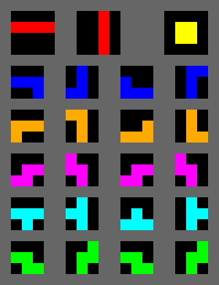

# Tetris Game

Version: 0.1  
Author: Filip Kohout  
Date: 20/09/2024  

## Table of Contents

1. Document Edit History  
2. Introduction  
3. Service Development  
4. Service Purpose  
5. Service Requirements  
    5.1 Functional Requirements  
    5.2 Non-Functional Requirements  

---

## Document Edit History

| Version | Author         | Comment Message         |  
|---------|----------------|-------------------------|  
| 0.1     | Filip Kohout    | First game estimates    |  
| 0.2     | Filip Kohout    | Defined blocks          |

---

## Introduction

**Purpose of the document:** The purpose of the document is to describe all the functional and non-functional requirements for the CLI-based Tetris game development project. This document serves as a guide for programmers, testers, and stakeholders, providing a clear overview of the system's requirements to ensure the game's development adheres to the design and expectations.  

**Targeted group:** Programmers, testers, and the marketing department.  

**Contacts:** kohout19fi.skola.ssps.cz  

**Other Reference Documents:** None at this moment. Any relevant documents will be added as the project progresses.

---

## Service Development  

The Tetris game will be developed as a command-line application (CLI) using **C#**. This programming language is chosen for its robust capabilities, ease of handling input/output operations, and strong community support. C# provides excellent performance and cross-platform compatibility via .NET, ensuring that the game will run smoothly on major operating systems such as Windows, Linux, and macOS.

The game will rely on simple keyboard input for interaction and console output for displaying the game board. Key features like tetromino movement, scoring, and line clearing will be implemented in a modular way for easy maintainability.

**Development Stages:**

1. **Initial Setup**:  
   - Develop the game board and grid structure using C# console output.
   - Implement basic keyboard controls for moving tetrominoes.

2. **Tetromino Logic**:  
   - Create the 7 different tetrominoes and implement their rotation and movement logic in C#.
   - Add gravity to simulate tetrominoes falling.

3. **Game Mechanics**:  
   - Implement line-clearing logic and scoring system.
   - Add level progression and speed increase as the player advances.

4. **User Interface & Experience**:  
   - Build a simple, user-friendly command-line interface that shows score, next tetromino, and game-over state.
   - Add pause and restart functionality.

5. **Testing & Optimization**:  
   - Conduct extensive testing for bugs, performance issues, and compatibility on different systems.
   - Optimize resource usage to ensure the game runs smoothly on minimal hardware.

---

## Service Purpose  

The primary purpose of this project is to create a minimalist version of Tetris that can run in any terminal or command-line interface. This game is designed for users who enjoy retro-style gaming experiences without needing a graphical environment. It also provides a fun way to practice logical thinking and quick decision-making, as the game increases in difficulty with every level.

Key purposes:

- Provide an engaging and simple game for retro gamers or users with minimal system resources.
- Offer an accessible gaming option that works on most operating systems.
- Allow players to compete for high scores in a lightweight, resource-efficient environment.

---

## Service Requirements  

### 5.1 Functional Requirements  

Functional requirements define the core behavior and features of the Tetris game.

1. **Game Board Setup**  
   - The game must have a 10x20 grid representing the play area.
   - The grid should be displayed using characters or symbols for blocks.

2. **Tetromino Types**  
   - The game must include all seven standard tetromino shapes: I, O, T, L, J, S, Z (shapes are specified in the image below)
   - Tetrominoes should be represented using characters.

   

3. **Tetromino Movement**  
   - Players must be able to move tetrominoes left and right using keyboard inputs.
   - The tetromino should fall automatically at a predefined speed.
   - Players must be able to rotate tetrominoes (clockwise and counterclockwise).
   - The tetromino must stop falling once it reaches the bottom or another block.

4. **Clearing Lines**  
   - When a full horizontal line is formed, it should be cleared, and the blocks above it should shift down.
   - Players should score points when lines are cleared.

5. **Game Over Condition**  
   - The game should end when a tetromino cannot be placed due to blocks filling the grid up to the top.

6. **Score Tracking**  
   - The game must keep track of the player's score, which increases based on the number of lines cleared.
   - A high score should be displayed at the end of the game.

7. **Levels and Speed**  
   - As the player progresses, the game should increase in difficulty by accelerating the falling speed of tetrominoes.
   - Level advancement can be based on the number of lines cleared.

8. **Pause and Restart Functionality**  
   - Players must be able to pause the game and resume later.
   - A restart option should be available to start a new game.

9. **Command-line Interface**  
   - The game must be playable via the command line, accepting user inputs for controlling the tetrominoes.

---

### 5.2 Non-Functional Requirements  

Non-functional requirements describe the qualities and constraints of the system that define how it performs or operates.

1. **Performance**  
   - The game should have minimal latency between user input and game response, ensuring real-time movement of the tetrominoes.
   - The system must be able to handle the game logic efficiently without significant delays or freezes, even as levels progress.

2. **Portability**  
   - The game must be compatible with major operating systems that support a command-line interface (e.g., Windows, Linux, macOS).
   - The game should not require any external graphical libraries, ensuring ease of use on minimal hardware.

3. **Usability**  
   - The game should have simple, intuitive controls for movement, rotation, and pausing.
   - Instructions on how to play and control the game should be provided at the start.

4. **Reliability**  
   - The game must handle incorrect inputs gracefully (e.g., pressing an invalid key should not crash the game).
   - The game should consistently save and display high scores between sessions if the system allows file handling.

5. **Scalability**  
   - The game should be able to handle increasingly fast tetromino movements as the player progresses through higher levels.

6. **Maintainability**  
   - The game code must be well-documented and modular to allow future improvements or bug fixes.
   - The code should be structured to make it easy for new developers to understand and contribute.

7. **Security**  
   - User inputs should be validated to prevent potential misuse or crashes from unexpected inputs.
   - No sensitive data is processed, but the game should avoid any potential command-line vulnerabilities.

8. **Resource Usage**  
   - The game should run efficiently with low CPU and memory usage to allow it to run on low-resource systems.
